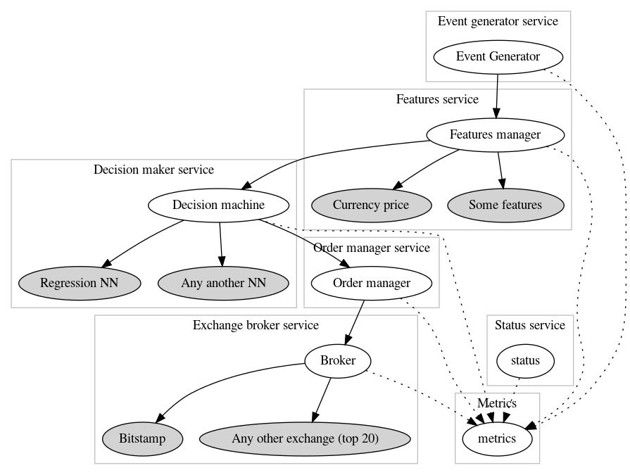

# Random Trader 
### http://randomtrader.net

## Random trader is an algorithmic trading system based on the random events.

The minimum viable product contains the minimum acceptable functionality. 
The goal for MVP is to create a trading bot, 
integrate any neural network into the decision making service 
and run it with one exchange.

As cloud platform it proposed to use Heroku, 
since that service allows to setup initial infrastructure in short time.
Moreover, the actions in configuration of the CI/CD pipeline takes less time 
than with others services, especially, 
for the people without experience with cloud services, 
full-time at work and at home, and with a limited time in general. It is very convenient! ;)

The system consists of:
 - events generator service
 - feature management service
 - decision management service
 - exchange broker service
 - status service
 - metrics service
 
 The brief overview.

## Contribution

Please feel free to submit any pull requests.

## Contributor List

|User|
|--|
| [mshogin](https://github.com/mshogin) |

